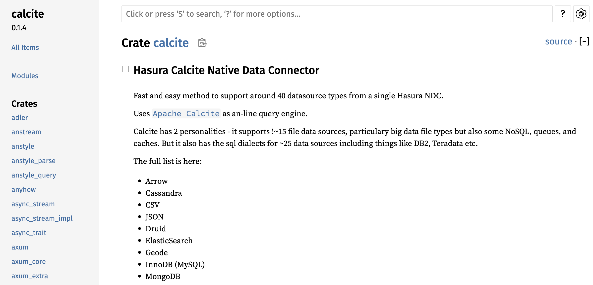

# NDC Calcite Connector

The Calcite connector implements a generic connector for ALL Calcite data sources. You modify the `configuration.json/model_file_path` to
change the underlying Calcite data source.

### Rust Docs

```sh
cd crates/ndc-calcite
cargo doc
open "../../target/doc/calcite/index.html"
```



